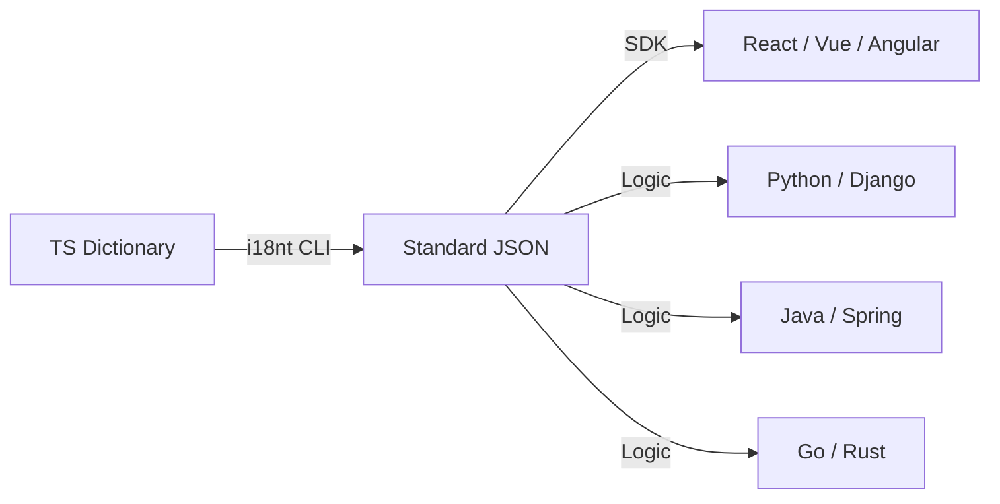

# i18nt

> 极致轻量的国际化框架 — 零依赖 · Proxy 驱动 · ICU 标准化 · 嵌套命名空间

简体中文 | [English](./README.en.md)

[](https://www.npmjs.com/package/@xiaode-ai/i18nt)
[](https://bundlephobia.com/package/@xiaode-ai/i18nt)
[](https://github.com/xiaode-ai/i18nt/blob/main/LICENSE)

## ✨ 特性

- **🚀 极速启动**：基于 **Recursive Proxy**，仅在访问时生成路径，初始化性能恒定为 **O(1)**，完美支持无限级嵌套。
- **📦 零依赖**：核心代码 **< 3KB** (gzip)，不引入任何第三方库。
- **🎯 100% ICU 标准对齐**：**[NEW]** 完美支持 `plural`, `select`, `list`, `unit`, `relative` 及复杂的 `skeleton` 语法。
- **🎨 富文本支持**：内置 `<tag>` 语法支持，可轻松插入 React/Vue 组件或 HTML 标签。
- **⚛️ 框架全适配**：原生支持 React (Hook/Provider), Vue 3 (Composition API/Plugin)。
- **🛠️ 智能化 CLI**：支持源码 **AST 高精度自动提取**、字典自动修复及 **AI 自动化翻译补全**。
- **🧩 企业级 AOT 优化**：**[NEW]** 支持构建时 **精准剪枝 (Pruning)** 与 **自动分包 (Splitting)**，从根本上解决超大规模字典的性能与包体积瓶颈。
- **🌐 插件生态**：提供浏览器探测、持久化缓存、**可视化原地编辑 v2 (Visual Edit)** 及 **跨标签页状态同步** 插件。
- **🛡️ 静态校验**：**[NEW]** 提供 `@xiaode-ai/eslint-plugin-i18nt`，支持 Key 存在性校验与 ICU 语法实时检查。
- **⚡ 极致 JIT 引擎**：运行时自动编译为纯函数渲染链，支持 **复数偏移 (Offset)**、**# 变量注入**、**缩放 (Scale)** 及 **区间/范围格式化 (Range)** 等极其复杂的 ICU 特性。
- **🛡️ 审计与监控**：**[NEW]** 内置 `auditPlugin`，实时追踪翻译命中率、缺失 Key 及从未使用的冗余词条。
- **🔄 框架集成细腻化**：**[NEW]** Next.js 适配层支持 `prefixStrategy` (如：仅非默认语言加前缀) 与组件化语言切换。
- **🧩 架构友好**：支持全局单例、翻译后处理链及 **微前端多实例协调**。
- **🔄 同构同步**：内置 `exportState`/`importState`，完美支持 SSR 脱水补水，无缝同步 AST 状态。
- **🛡️ 显式上下文**：**[NEW]** 支持 `context` 参数，轻松处理 `friend_male`/`friend_female` 等细分场景。
- **🧪 完整性校验**：**[NEW]** 内置 `validate()` 方法，全自动检测各语言字典间的缺失 Key。
- **🌍 工业级格式支持**：**[NEW]** CLI 支持导出/导入 **XLIFF (1.2)**、**Gettext (PO)**、iOS (`.strings`)、Android (`xml`)、Flutter (`arb`) 等专业翻译格式。
- **🌍 自动化语言探测**：**[NEW]** 内置支持从 URL (路径/参数)、Cookie、LocalStorage 及浏览器 Header/Navigator 自动检测语言，并针对 **Bun/Node.js** 环境提供原生支持。
- **🛡️ 极致 ICU 转义**：**[NEW]** 完美支持单引号转义 (`'{}'`) 与复杂的嵌套标签解析，严格遵循 Unicode ICU 规范。
- **🔌 插件化生态**：内置远程字典加载、缺失 Key 上报、多维语言探测 (含 Bun/Node.js) 等工业级插件。
- **🛠️ 深度调试**：增强型 Debug 模式，可视化高亮翻译状态与缺失节点。

## 📦 安装

推荐使用 **Bun** 以获得极致的开发与运行时性能：

```bash
bun add @xiaode-ai/i18nt
# 或者使用 npm/pnpm
npm i @xiaode-ai/i18nt
# 安装静态校验插件 (可选)
bun add -d @xiaode-ai/eslint-plugin-i18nt
```

### 🛡️ 静态分析配置 (ESLint)
在 `.eslintrc.js` 中添加配置，实时拦截无效 Key 引用：
```js
module.exports = {
  plugins: ['@xiaode-ai/i18nt'],
  rules: {
    '@xiaode-ai/i18nt/no-unknown-key': ['error', { dictionaryPath: 'src/i18n/dict.ts' }],
    '@xiaode-ai/i18nt/valid-icu-message': 'warn'
  }
};
```

## 🚀 快速上手

### 1. 定义翻译字典

```ts
// src/i18n/dict.ts
export const LANG_ORDER = ["zh-CN", "en-US"] as const;

export const TRANSLATIONS = {
  // 基础文本
  buttons: {
    save: ["保存", "Save"],
  },
  // ICU MessageFormat
  cart: [
    "{count, plural, =0{空购物车} other{购物车中有 # 件商品}}",
    "{count, plural, =0{Empty} other{# items in cart}}",
  ],
};
```

### 2. 初始化并使用

```ts
import { createI18n } from "@xiaode-ai/i18nt";
import { TRANSLATIONS, LANG_ORDER } from "./i18n/dict";

const i18n = createI18n({
  translations: TRANSLATIONS,
  langOrder: LANG_ORDER,
  locale: "zh-CN", // 或设为空字符串以触发自动探测
  detection: {
    order: ['querystring', 'cookie', 'localStorage', 'navigator'],
    lookupQuerystring: 'lng',
    caches: ['localStorage', 'cookie']
  }
});

const { t } = i18n;

// Proxy 驱动的属性访问，享受完美类型提示
console.log(t.buttons.save); // "保存"

// 函数式调用处理 ICU 逻辑
console.log(t("cart", { count: 3 })); // "购物车中有 3 件商品"

// 富文本标签支持
const result = t("agree", { 
  link: (text) => `<a href="/terms">${text}</a>` 
}); // ["请阅读 ", "<a href="/terms">使用协议</a>"]

// 显式上下文支持 [NEW]
// translations: { friend: "朋友", friend_male: "男朋友", friend_female: "女朋友" }
t.friend({ context: 'male' }); // "男朋友"
```

## ⚛️ React 集成

`i18nt` 提供了官方 React 适配层，支持全局状态管理与组件级重绘。

### 配置 Provider

```tsx
import { I18nProvider } from "@xiaode-ai/i18nt/react";

function Root() {
  return (
    <I18nProvider config={{ translations, langOrder, locale: 'zh-CN' }}>
      <App />
    </I18nProvider>
  );
}
```

### 在组件中使用

```tsx
import { useI18n } from "@xiaode-ai/i18nt/react";

function UserProfile() {
  const { t, setLocale, locale } = useI18n();

  return (
    <div>
      <p>{t.profile.welcome}</p>
      <button onClick={() => setLocale('en-US')}>Switch to English</button>
    </div>
  );
}
```

## 🛠️ CLI 进阶：分布式翻译管理

对于大型项目，建议将翻译字典分散在各业务模块中。`i18nt` CLI 可以自动聚合它们。

### 目录结构示例
```text
src/
  auth/
    i18n.ts      // 定义 auth 命名空间
  settings/
    i18n.ts      // 定义 settings 命名空间
```

### 自动化操作
```bash
# 1. 校验并自动修复翻译字典（自动补全缺失语言项、格式化等）
npx i18nt fix --input src/

# 2. [NEW] 调用 AI 自动补全缺失的翻译
npx i18nt translate

# 3. [NEW] 生产环境字典剪枝：扫描源码并物理移除从未使用的 Key
npx i18nt prune --input src/

# 4. 递归扫描 src/ 目录，自动基于文件名聚合命名空间并导出 JSON
npx i18nt export --input src/ --lang all --output ./.i18nt/locales/

# 4. 扫描源码，通过 AST 自动提取翻译 Key（支持默认值提取）
npx i18nt extract --input src/

# 5. [NEW] 同步字典到专业翻译管理系统 (TMS: Lokalise, Crowdin)
npx i18nt sync --provider lokalise --projectId xxx

### 🚀 Bun 开发者
`i18nt` 完美支持 Bun 运行时，您可以直接运行：
```bash
bun x i18nt help
```

### 🌍 多端同步导出 (Cross-Platform Sync)
`i18nt` 可以作为企业级的 **SSOT (唯一事实来源)**，将 TypeScript 字典同步到任何开发环境：

```bash
# 导出为 Flutter ARB 格式
npx i18nt export --platform flutter

# 导出为 Android 原生 strings.xml (自动转换 ICU Plurals)
npx i18nt export --platform android

# 导出为 iOS Localizable.strings
npx i18nt export --platform ios

# 导出后端语言 (Go/Rust/Java/Python...)，自动生成变量注释
npx i18nt export --format go
```

目前支持的格式包括：`json`, `py`, `php`, `go`, `rust`, `kt`, `java`, `cs`, `cpp`, `rb`, `lua`, `c`, `scala`, `js`, `ex`, `pl`, `m`, `hs`, `xml`, `strings`, `arb`, `po`, `xliff`。
- `I18NT_AI_PROVIDER`: `openai` (默认), `gemini`, `deepseek`
- `I18NT_AI_API_HOST`: 自定义 API 域名
- `I18NT_AI_MODEL`: 指定模型名称

## 🛡️ TypeScript 类型安全

得益于 **Recursive Proxy**，您只需定义好基础字典，即可在任何地方获得全自动的代码补全：

```ts
// 1. 即使是 10 层嵌套，i18nt 也能准确推导出类型
t.a.b.c.d.e.f.g.h.i.j; 

// 2. [NEW] 自动提取 ICU 变量
t.cart({ count: 3 }); // "You have 3 items in your cart"

// 3. [NEW] ICU 深水区特性支持
// 骨架语法 (Skeleton)
t.price({ v: 1234.5 }); // "{v, number, :: currency/USD precision-integer}" -> "$1,235"

// 相对时间风格 (Relative Time Styles)
t.ago({ val: -1 }); // "{val, relative, day always}" -> "1 day ago"

// 复合单位 (Unit Formatting)
t.speed({ val: 100 }); // "{val, unit, kilometer-per-hour narrow}" -> "100km/h"

// 高级列表 (List Formatting)
t.users({ v: ['A', 'B', 'C'] }); // "{v, list, disjunction short}" -> "A, B, or C"
```

## 🔌 插件生态

```ts
import { 
  browserDetector, 
  languageCache, 
  syncPlugin, 
  remoteBackend, 
  reportMissingKey, 
  auditPlugin,
  locationDetector 
} from "@xiaode-ai/i18nt/plugins";

const i18n = createI18n({
  plugins: [
    browserDetector(), // 自动探测浏览器语言
    languageCache(),   // 自动持久化到 localStorage
    syncPlugin(),      // [NEW] 跨浏览器标签页实时同步语言状态
    remoteBackend({    // [NEW] 远程字典加载
      loadUrl: (loc) => `https://api.example.com/locales/${loc}.json`
    }),
    reportMissingKey({ // [NEW] 缺失 Key 自动上报
      endpoint: 'https://api.example.com/report-missing-i18n'
    }),
    auditPlugin({      // [NEW] 性能审计与瘦身建议
      onReport: (rep) => console.log('I18n Audit:', rep)
    }),
    locationDetector({ type: 'path' }) // [NEW] 从 URL 路径探测语言
  ],
  // 全局格式化默认配置 [NEW]
  numberFormatOptions: { minimumFractionDigits: 2 },
  dateFormatOptions: { dateStyle: 'long' },
  // 自动化命名空间管理 [NEW]
  maxNamespaces: 50 // 基于 LRU 自动清理过期命名空间
});
```

## ⚔️ 库对比

为了帮助您做出选择，我们将 `i18nt` 与社区主流国际化方案进行了深度对比：

| 特性 / 库                     | **i18nt** | i18next | FormatJS | LinguiJS | next-intl |
| :---------------------------- | :---: | :---: | :---: | :---: | :---: |
| **核心体积 (Gzip)**           | **< 3KB** | ~40KB+ | ~30KB | ~5KB (runtime) | ~10KB |
| **第三方依赖数量**            | **0 (纯净)** | 15+ | 10+ | 5+ | 8+ |
| **类型安全 (Type Safety)**    | **Proxy 驱动 (全自动)** | 字符串驱动 (需手动维护) | 消息 ID 驱动 (需插件) | **编译时宏提取** | 字符串驱动 (需配置) |
| **ICU 变量类型推断**          | **✅ 智能提取并推断** | ❌ (需手动传参) | ✅ (依赖工具链) | ✅ (编译时静态检查) | ✅ (依赖 TS 插件) |
| **性能模式**                  | **✅ Proxy + AST 缓存** | ❌ 运行时解析 | ❌ 运行时解析 | **✅ AOT 编译** | ❌ 运行时解析 |
| **RSC (Server Components)**   | **✅ 原生零延迟支持** | ✅ (需中间件适配) | ✅ (体积较大) | ✅ (原生支持) | **✅ 深度集成** |
| **AI 自动化工作流**           | **✅ 内置 (AI 翻译/提取)** | ❌ | ❌ | ❌ | ❌ |
| **跨语言逻辑复用 (SSOT)**      | **✅ 一键导出多端逻辑** | ❌ (仅限 JS 环境) | ❌ | ❌ | ❌ |
| **运行时开销**                | **O(1) (路径无关)** | O(N) (解析路径) | O(N) | O(1) (编译后) | O(N) |

### 为什么选择 i18nt？

1. **类型安全的新高度**：传统的 i18n 库通常使用字符串 Key (`t('a.b.c')`)，这在重构时是灾难。`i18nt` 使用 **Recursive Proxy**，让你可以像访问普通对象一样访问翻译项 (`t.a.b.c`)，这意味着 **IDE 的重构重命名、查找引用、自动补全** 对国际化代码同样有效。
2. **不仅仅是 JS 库**：通过强大的 CLI，`i18nt` 可以作为你全栈项目的**唯一事实来源 (SSOT)**。在 TS 中定义的复杂 ICU 逻辑，可以一键同步给 Python 后端或移动端原生代码，保持多端逻辑绝对一致。
3. **极致性能**：在处理拥有数万条词条的大型字典时，`i18nt` 的 Proxy 机制确保了首屏加载时**几乎零解析开销**。只有当你真正访问某个页面上的某句话时，相关的路径才会被即时计算。
4. **AI 时代的开发者体验**：内置对主流 AI 模型（OpenAI, Gemini, DeepSeek）的支持。告别手动查表翻译，CLI 自动识别新增词条并完成高质量翻译。

## 🌍 跨语言与多端支持

`i18nt` 核心零依赖，并为各类流行框架和后端语言提供了全方位的适配方案：

### 1. 前端框架原生适配
针对前端生态，我们提供了深度的 API 集成，确保极致的开发体验：

- **🟢 Vue 3**: 提供插件支持 `app.use(createI18nPlugin(...))`。
- **🌍 Next.js (App Router)**: 原生支持 Server Components (RSC) 与中间件重定向。
- **📱 React Native**: 自动同步系统级 RTL 状态，支持原生端渲染。
- **🅰️ Angular**: 支持 Signal 响应式与 Pipe 语法。

### 2. 跨语言后端支持 (Python, Java, Go, Rust)
虽然 `i18nt` 核心是 JS/TS，但其 **CLI 工具链** 和 **ICU 标准协议** 使其能完美支持任何编程语言的项目：

- **标准协议**: 基于 **ICU MessageFormat**，导出的逻辑在各端完全通用。
- **原生导出**: CLI 支持通过 `--format` 一键导出 `.py`, `.php`, `.go`, `.rs`, `.xml`, `.strings` 等格式。
- **唯一事实来源 (SSOT)**: 在 TS 中定义业务逻辑，一键同步给全栈。



### 3. 环境兼容性
- **浏览器**: 支持 Chrome, Edge, Safari, Firefox 等现代浏览器 (需支持 Proxy)。
- **Node.js**: 支持 14.x+ 版本，适用于 CLI 工具和服务端渲染。
- **Bun**: 完美支持，提供高性能运行时与原生语言探测。

## 🛣️ 路由与中间件 (Next.js Middleware)
利用内置助手轻松实现语言重定向与前缀策略：

```ts
// middleware.ts
import { createI18nMiddleware } from '@xiaode-ai/i18nt/next';

export default createI18nMiddleware({
  locales: ['en', 'zh'],
  defaultLocale: 'en',
  prefixStrategy: 'as-needed' // 仅非默认语言 (zh) 显示路径前缀
});
```

#### 语言切换器组件 (LocaleSwitcher)
```tsx
const { LocaleSwitcher } = createNavigation(config);

function LanguageSelect() {
  return (
    <LocaleSwitcher>
      {({ locales, current, switch: changeLocale }) => (
        <select value={current} onChange={(e) => changeLocale(e.target.value)}>
          {locales.map(l => <option key={l} value={l}>{l}</option>)}
        </select>
      )}
    </LocaleSwitcher>
  );
}
```

### 📱 React Native
自动同步原生 RTL 状态：
```tsx
import { I18nNativeProvider } from '@xiaode-ai/i18nt/native';

function App() {
  return (
    <I18nNativeProvider config={config}>
      <Main />
    </I18nNativeProvider>
  );
}
```

### 🅰️ Angular
支持 Signal 与 Pipe：
```ts
// app.config.ts
providers: [
  provideI18n(config) // 或共享实例 provideI18n(sharedI18n)
]

// component.html
<p>{{ 'welcome' | t }}</p>
```

## 🧩 高级进阶

### 按需加载命名空间
对于大型项目，您可以配置动态加载器：
```ts
const i18n = createI18n({
  locale: 'zh-CN',
  loaders: {
    admin: () => import('./locales/admin.ts'),
    settings: () => import('./locales/settings.ts')
  }
});

// 在需要时加载
await i18n.loadNamespace('admin');
```

### 🔗 多级回退链 (Fallback Chains)
支持复杂的地域语言回退，例如：从香港繁体回退到台湾繁体，再回退到简体中文：
```ts
const i18n = createI18n({
  locale: 'zh-HK',
  fallbacks: {
    'zh-HK': ['zh-TW'],
    'zh-TW': ['zh-CN']
  }
});
```

### 🛡️ XSS 安全与插值
默认情况下，`i18nt` 会转义插值变量中的 HTML 字符。若需渲染原始 HTML，请使用双花括号语法：
```ts
t("welcome", { name: "<b>World</b>" }); // -> "Hello &lt;b&gt;World&lt;/b&gt;"
t("welcome", { content: "<b>World</b>" }); // 字典中为 {{content}} -> "Hello <b>World</b>"
```

### ⚡ 性能飞跃：预解析与 AOT 优化 (Pre-parsing & AOT)
`i18nt` 的 Vite 插件提供了工业级的 AOT 优化方案，专为大规模词典设计：

- **精准剪枝 (Pruning)**：自动通过 AST 扫描源码，物理移除生产包中未被引用的 Key。
- **自动分包 (Splitting)**：支持 `splitThreshold`。当单语言字典超过阈值（如 100KB）时，自动按顶级命名空间拆分为独立 Chunk，实现真正的 **Incremental Hydration**。
- **构建时预编译**：将所有 ICU 字符串提前转换为 AST 对象或渲染函数，消除客户端解析成本。
- **静态宏替换 (Macro)**：在单语言版本构建中，直接将 `t.key` 替换为静态文本字符串。

```ts
// vite.config.ts
import { i18ntVitePlugin } from '@xiaode-ai/i18nt';

export default {
  plugins: [
    i18ntVitePlugin({
      prune: true,
      splitThreshold: 50 * 1024, // 超过 50KB 自动分包
      preCompile: true
    })
  ]
}
```

### 🔍 调试与诊断 (Debug Plugin)
使用调试插件可以轻松追踪缺失的 Key 并在控制台获取详细报告。

### 🏛️ 全局单例与后处理 (Architecture)
支持在全局范围共享实例，并对翻译结果进行二次加工（如 Markdown 处理）。

### 🧹 生产环境字典剪枝 (Dictionary Pruning)
在生产环境中，你可以根据实际使用到的 Key 列表对字典进行剪枝，释放冗余内存。

### 🖖 Vue 3 集成
```ts
import { createI18nPlugin, useI18n } from "@xiaode-ai/i18nt/vue";

const app = createApp(App);
app.use(createI18nPlugin(i18n));

// 在组件中
const { t, locale } = useI18n();
```

### 🌐 微前端多实例同步 (I18nManager)
在微前端架构中，使用 `I18nManager` 统一管理基座与子应用的语言状态。

### ⚡ SSR 同构同步 (Hydration)
在服务端导出状态并在客户端还原，可避免客户端重复解析 ICU 字符串。

### ✍️ 语言学后处理 (Processors)
内置常用处理器，支持链式加工：
```ts
import { upper, miniMarkdown } from "@xiaode-ai/i18nt/processors";

const i18n = createI18n({
  postProcessors: [upper, miniMarkdown]
});
```

## ☁️ 远程字典与 OTA (Over-The-Air)
无需重新发布代码，即可更新翻译：
```ts
const i18n = createI18n({
  otaLoader: async (locale) => {
    const res = await fetch(`https://api.tms.com/locales/${locale}`);
    return res.json();
  }
});
```

### 🚀 框架深度集成 (Next.js 示例)

#### 1. 服务端组件 (RSC)
```tsx
// app/[locale]/layout.tsx
import { getI18nServer } from '@xiaode-ai/i18nt/next';

export default async function Layout({ params: { locale }, children }) {
  const i18n = getI18nServer(undefined, locale);
  return (
    <html lang={locale} dir={i18n.isRTL ? 'rtl' : 'ltr'}>
      <body>{children}</body>
    </html>
  );
}
```

#### 2. SEO 与 静态生成
```tsx
// app/[locale]/page.tsx
import { createNavigation } from '@xiaode-ai/i18nt/next';

const { getMetadata, getStaticParams } = createNavigation({ locales: ['en', 'zh'], defaultLocale: 'en' });

export const generateStaticParams = getStaticParams;

export async function generateMetadata({ params: { locale } }) {
  return getMetadata({ pathname: '/', baseUrl: 'https://example.com' });
}
```

## 📄 开源协议

MIT
